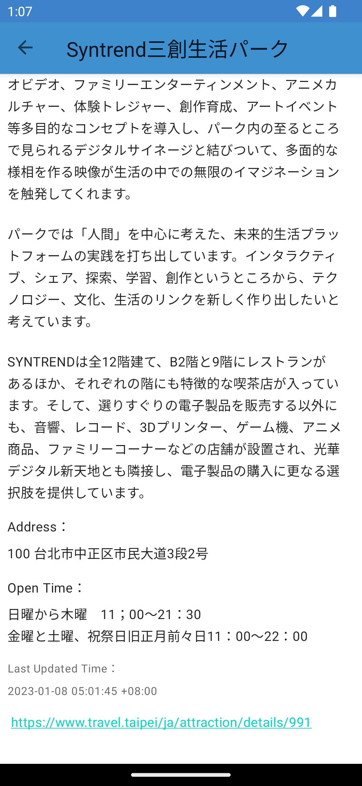
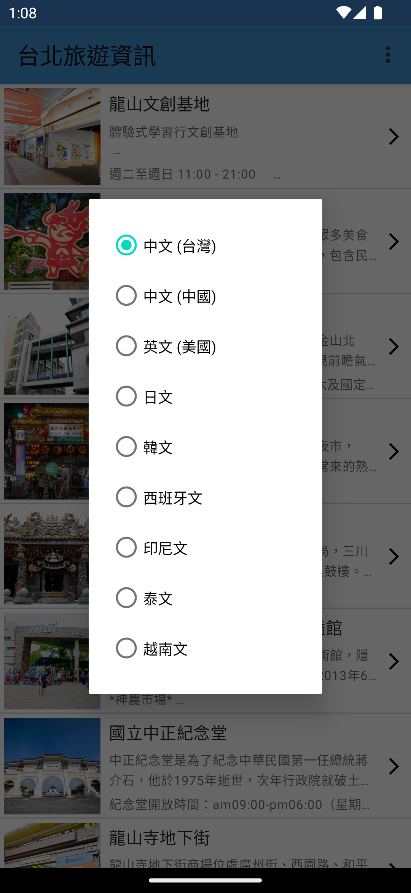
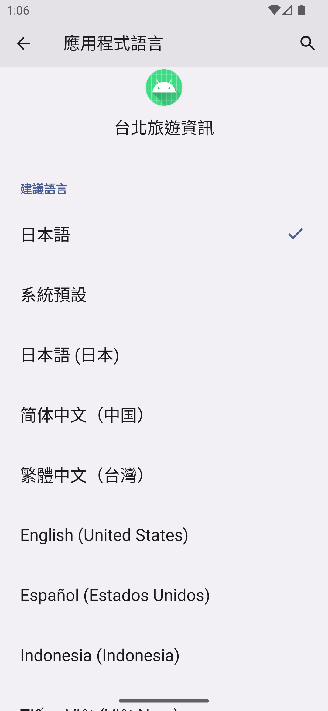

# Taipei Tour

A simple app to display data from [台北旅遊資訊API]("www.travel.taipei/open-api")

## Tech Stacks
- [x] [Navigation Component](https://developer.android.com/guide/navigation)
- [x] [Hilt](https://developer.android.com/training/dependency-injection/hilt-android)
- [x] [App Locale Setting](https://developer.android.com/guide/topics/resources/app-languages)

## TODO Features
- [ ] Attractions page can load more
  [Use Paging3](https://developer.android.com/topic/libraries/architecture/paging/v3-overview)
- [ ] Attraction detail page images carousel effect [Use MotionLayout](https://developer.android.com/develop/ui/views/animations/motionlayout/carousel)
- [ ] New my favorite page [Use Room](https://developer.android.com/training/data-storage/room)

## Architecture
DataBinding + MVVM + LiveData + Coroutine + Repository + Retrofit

## ScreenShots

